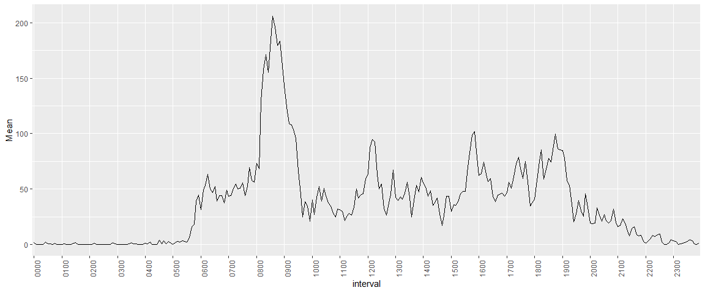

## Loading and preprocessing the data

```r
library(tidyverse)
```

```
## -- Attaching packages -- tidyverse 1.3.0 --
```

```
## v ggplot2 3.3.2     v purrr   0.3.4
## v tibble  3.0.3     v dplyr   1.0.0
## v tidyr   1.1.0     v stringr 1.4.0
## v readr   1.3.1     v forcats 0.5.0
```

```
## -- Conflicts ----- tidyverse_conflicts() --
## x dplyr::filter() masks stats::filter()
## x dplyr::lag()    masks stats::lag()
```

```r
library(ggplot2)
library(lubridate)
```

```
## 
## Attaching package: 'lubridate'
```

```
## The following objects are masked from 'package:base':
## 
##     date, intersect, setdiff, union
```

```r
if(!dir.exists("activity.csv"))
{
  unzip("activity.zip")
}
data<- read.csv("activity.csv")
# data$interval<- as.factor(data$interval)
data$date<- as.factor(data$date)
```


## What is mean total number of steps taken per day?

```r
s1 <- data %>%
  group_by(date)%>%
  summarise(Total=sum(steps,na.rm=T))
```

```
## `summarise()` ungrouping output (override with `.groups` argument)
```

```r
s1%>%pull(Total)%>% mean()
```

```
## [1] 9354.23
```

```r
s1%>%pull(Total)%>% median()
```

```
## [1] 10395
```

```r
names(s1) <- c("Date","Total") 
s1%>%ggplot(aes(Date,Total)) +
  geom_histogram(stat = "identity")+
  theme(axis.text.x = element_text(angle = 90))
```

```
## Warning: Ignoring unknown parameters: binwidth, bins, pad
```

<!-- -->


## What is the average daily activity pattern?

```r
s2<- data%>%
  mutate(interval=sprintf("%04d",interval))%>%
  group_by(interval)%>%
  summarise(Mean=mean(steps,na.rm=T))%>%
  ungroup()
```

```
## `summarise()` ungrouping output (override with `.groups` argument)
```

```r
s2%>%
  ggplot(aes(interval,Mean))+
  geom_line(group=1)+
  theme(axis.text.x = element_text(angle = 90))+
  scale_x_discrete(breaks=sprintf("%02d",0:24)%>%paste0(.,"00"))
```

<!-- -->

```r
s2%>%
  with(.,{
    interval[which.max(Mean)]
  })
```

```
## [1] "0835"
```


## Imputing missing values

```r
new_data<- data%>%
  mutate(interval=sprintf("%04d",interval))
for(i in 1:nrow(new_data))
{
  if(is.na(data$steps[i]))
  {
    new_data$steps[i]=s2$Mean[which(s2$interval==new_data$interval[i])]
  }
}
s3 <- new_data %>%
  group_by(date)%>%
  summarise(Total=sum(steps,na.rm=T))
```

```
## `summarise()` ungrouping output (override with `.groups` argument)
```

```r
s3%>%pull(Total)%>% mean()
```

```
## [1] 10766.19
```

```r
s3%>%pull(Total)%>% median()
```

```
## [1] 10766.19
```

```r
names(s3) <- c("Date","Total") 
s3%>%ggplot(aes(Date,Total)) +
  geom_histogram(stat = "identity")+
  theme(axis.text.x = element_text(angle = 90))
```

```
## Warning: Ignoring unknown parameters: binwidth, bins, pad
```

<!-- -->


## Are there differences in activity patterns between weekdays and weekends?

```r
new_data$date<- new_data$date%>%as.Date()

new_data$WeekdayType<-new_data$date%>%weekdays()%>% sapply(.,function(x){ifelse(x %in% c("Saturday","Sunday"),"Weekend","Weekday")})

new_data%>%
  group_by(interval,WeekdayType)%>%
  summarise(Mean=mean(steps))%>%
  ggplot(aes(interval,Mean,group=WeekdayType))+
  geom_line(group=2)+
  facet_grid(WeekdayType~.)+
  theme(axis.text.x = element_text(angle = 90))+
  scale_x_discrete(breaks=sprintf("%02d",0:24)%>%paste0(.,"00"))
```

```
## `summarise()` regrouping output by 'interval' (override with `.groups` argument)
```

<!-- -->
